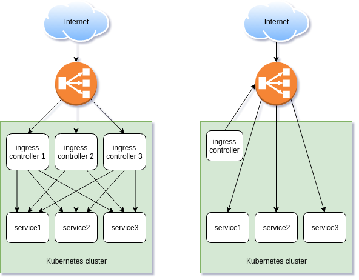

## ingress-terraform

A Kubernetes ingress controller, which allows to manage LBaaS resources using the Terraform.

## Overview

The project is still in early alpha. There can be significan code and behavior changes.

Since the LBaaS resources is not the part of the Kubernetes cluster, regular services cannot be accessed. Therefore if you want to expose the service for the loadbalancer, you have to expose it as a [node port](https://kubernetes.io/docs/concepts/services-networking/service/#nodeport).

Config [examples](/examples).

## Why

Loadbalancers can be created within the Kubernetes Cloud Providers, but their configuration is not flexible. Moreover the ingress-terraform allows to create one loadbalancer for multiple services.

## Supported clouds

* OpenStack

## Features

* TLS certificates (`TERMINATED_HTTPS`)
* TCP listeners
* UDP listeners (experimental, available only for Octavia API)
* Templated terraform script

## Comparison with a regular ingress controller

On the left side is a regular ingress controller, which resides inside the Kubernetes cluster.

On the right side is a Terraform ingress controller. It doesn't receive the ingress traffic, but only manages the loadbalancer. If Terraform ingress controller is down, the loadbalancer will still work.

Each Kubernetes ingress resource represents a loadbalancer.



## Configuration

The following OpenStack auth options are supported:

* `auth-url`: The URL of the keystone API used to authenticate. On
  OpenStack control panels, this can be found at Access and Security > API
  Access > Credentials.
* `password`: Refers to the password of a valid user set in keystone.
* `username`: Refers to the username of a valid user set in keystone.
* `domain-id`: Used to specify the ID of the domain your user belongs
  to.
* `domain-name`: Used to specify the name of the domain your user
  belongs to.
* `region`: Used to specify the identifier of the region to use when
  running on a multi-region OpenStack cloud. A region is a general division of
  an OpenStack deployment. Although a region does not have a strict geographical
  connotation, a deployment can use a geographical name for a region identifier
  such as `us-east`. Available regions are found under the `/v3/regions`
  endpoint of the Keystone API.
* `tenant-id`: Used to specify the ID of the project where you want
  to create your resources. When using Keystone V3 - which changed the
  identifier `tenant` to `project` - the `tenant-id` value is automatically
  mapped to the project construct in the API.
* `tenant-name`: Used to specify the name of the project where you
  want to create your resources.
* `tenant-domain-id`: Used to specify the ID of the domain your project belongs
  to.
* `tenant-domain-name`: Used to specify the name of the domain your project
  belongs to.
* `user-domain-id`: Used to specify the ID of the domain your user belongs to.
* `user-domain-name`: Used to specify the name of the domain your user belongs
  to.
* `application-credential-id`: The ID of an application credential to
  authenticate with. An `application-credential-secret` has to bet set along
  with this parameter.
* `application-credential-name`: The name of an application credential to
  authenticate with.
* `application-credential-secret`: The secret of an application credential to
  authenticate with.

Example auth config:

```yaml
kind: ConfigMap
apiVersion: v1
metadata:
  name: terraform-ingress-controller-config
data:
  config: |
    cluster-name: terraform-ingress-cluster
    openstack:
      auth-url: %os_auth_url%
      username: %os_username%
      password: %os_password%
      tenant-id: %os_tenant_id%
      domain-id: %os_domain_id%
    terraform:
      subnet-id: 058d9dce-7a62-4d8c-ac82-6b217d697e81
      floating-network-id: 8f408a7c-4d03-4355-81c1-07713fa0caec
      floating-subnet-id: 9206c010-882f-4059-914e-f25b33139c40
      manage-security-groups: true
      create-monitor: true
      monitor-delay: "5"
      monitor-timeout: "3"
      monitor-max-retries: 3
```

### Supported annotations

When you specify a configmap name, make sure it exists within the same namespace as an ingress resource.

|Name|Type|Default|Description|
|-|-|-|-|
|terraform.ingress.kubernetes.io/internal|true\|false|false|whether to assign a floating IP to the loadbalancer or not|
|terraform.ingress.kubernetes.io/tcp-configmap|string|N/A|a config map name with a TCP service ports map|
|terraform.ingress.kubernetes.io/udp-configmap|string|N/A|a config map name with a UDP service ports map (supported only in Octavia API)|
|terraform.ingress.kubernetes.io/template|string|N/A|a config map name with a custom terraform script template|
|terraform.ingress.kubernetes.io/skip-http-listener|true\|false|false|whether to skip the HTTP (80 TCP port) listener creation|
|terraform.ingress.kubernetes.io/use-octavia|true\|false|false|whether Terraform provider should use Octavia API instead of Neutron LBaaS v2|
|terraform.ingress.kubernetes.io/lb-method|string|`ROUND_ROBIN`|a load balancer method, can be `ROUND_ROBIN`, `LEAST_CONNECTIONS` or `SOURCE_IP`|
|kubernetes.io/ingress.class|string|N/A|must have the `terraform` value to be processed by the Terraform Ingress Controller|

## Getting started

* Clone the repo
* Change the current dir to `examples`
* Modify the config file

```sh
$ kubectl -n kube-system apply -f config.yaml
$ kubectl -n kube-system apply -f serviceaccount.yaml
$ kubectl -n kube-system apply -f deployment.yaml
```

Expose the HTTP service as a node port and deploy the ingress resource:

```sh
$ kubectl run --image=nginx nginx --port=80
$ kubectl expose deployment nginx --type=NodePort --target-port=80
$ kubectl apply -f test-terraform-ingress.yaml
```

Read ingress controller logs:

```sh
$ kubectl -n kube-system logs -f -l k8s-app=terraform-ingress-controller
```

## TODO

* Handle signals, e.g. wait for terraform to finish, when ingress controller received the exit signal
* Add finalizer to the ingress resource
* Add intermediate CA support (so far they can be concatenated into the certificate)
* Output terraform script diff
* Prepend logging loadbalancer UID
* Put openstack secrets into the secret and watch for its modification
* Add terraform execution time measurements
* Add additional annotations into ingress to pass custom resources into the template
* Remove OpenStack-only requirement
* Add more watchers and update loadbalancers on tls/node/secret/configmap change events
* Add parallel workers
* Add tests
* Proper logging

## Credits

The current project is based on the [octavia-ingress-controller](https://github.com/kubernetes/cloud-provider-openstack/blob/master/docs/using-octavia-ingress-controller.md) code.
